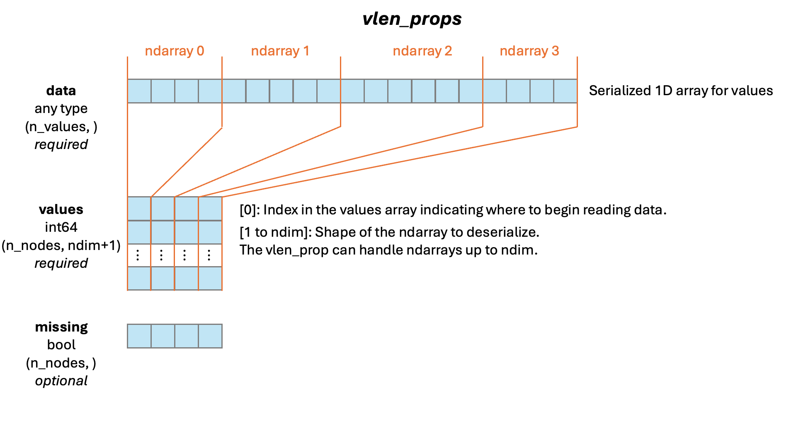

# GEFF specification

The graph exchange file format is `zarr` based. A graph is stored in a zarr group, which can have any name. However the name of the group can include the `.geff` suffix to indicate that the group contains `geff` data. This allows storing multiple `geff` graphs inside the same zarr root directory. A `geff` group is identified by the presence of a `geff` key in the `.zattrs`. Other `geff` metadata is also stored in the `.zattrs` file of the `geff` group, nested under the `geff` key. The `geff` group must contain a `nodes` group and an `edges` group (albeit both can be empty). `geff` graphs have the option to provide properties for `nodes` and `edges`.

`geff` graphs have the option to provide time and spatial dimensions as special attributes. These attributes are specified in the `axes` section of the metadata, inspired by the OME-zarr `axes` specification.

## Zarr specification

Currently, `geff` supports zarr specifications [2](https://zarr-specs.readthedocs.io/en/latest/v2/v2.0.html) and [3](https://zarr-specs.readthedocs.io/en/latest/v3/core/index.html). However, `geff` will default to writing specification 2 because graphs written to the zarr v3 spec will not be compatible with all applications. When zarr 3 is more fully adopted by other libraries and tools, we will move to a zarr spec 3 default.

::: geff_spec.GeffMetadata
    options:
        heading_level: 2
        filters:
            - "!read"
            - "!write"
        docstring_section_style: list
        show_symbol_type_heading: false
        show_symbol_type_toc: false

## The `nodes` group

The nodes group will contain an `ids` array and optionally a `props` group.

### The `ids` array

The `nodes\ids` array is a 1D array of node IDs of length `N` >= 0, where `N` is the number of nodes in the graph. Node ids must be unique. Node IDs must have an integer dtype. For large graphs, `int64` might be necessary to provide enough range for every node to have a unique ID. In the minimal case of an empty graph, the `ids` array will be present but empty.

### The `props` group and `node property` groups

The `nodes\props` group is optional and will contain one or more `node property` groups, each with a `values` array and an optional `missing` array.

- `values` arrays can be any zarr supported dtype, and can be N-dimensional. The first dimension of the `values` array must have the same length as the node `ids` array, such that each row of the property `values` array stores the property for the node at that index in the ids array. String  values will be stored according to the [zarr-extensions string specification](https://github.com/zarr-developers/zarr-extensions/tree/main/data-types/string) - as variable length UTF8 strings.

- The `missing` array is an optional, a one dimensional boolean array to support properties that are not present on all nodes. A `1` at an index in the `missing` array indicates that the `value` of that property for the node at that index is None, and the value in the `values` array at that index should be ignored. If the `missing` array is not present, that means that all nodes have values for the property.

- Geff provides special support for spatio-temporal properties, although they are not required. When `axes` are specified in the `geff` metadata, each axis name identifies a spatio-temporal property. Spatio-temporal properties are not allowed to have missing arrays. Otherwise, they are identical to other properties from a storage specification perspective.

- The `seg_id` property is an optional, special node property that stores the segmenatation label for each node. The `seg_id` values do not need to be unique, in case labels are repeated between time points. If the `seg_id` property is not present, it is assumed that the graph is not associated with a segmentation.

!!! note

    When writing a graph with missing properties to the geff format, you must fill in a dummy value in the `values` array for the nodes that are missing the property, in order to keep the indices aligned with the node ids.

#### Shape properties 

Geff provides special support for predefined shape properties, although they are not required. These currently include `sphere`, `ellipsoid`, `polygon` and mesh. Values can be marked as `missing`, and a geff graph may contain multiple different shape properties. Units of shapes are assumed to be the same as the units on the spatial axes. Otherwise, shape properties are identical to other properties from a storage specification perspective. 

- `sphere`: Hypersphere in n spatial dimensions, defined by a scalar radius. 

- `ellipsoid`: Defined by a symmetric positive-definite covariance matrix, whose dimensionality is assumed to match the spatial axes.

- `polygon`: Defined by a series of points matching the dimensionality of the spatial axes. Each point is defined relative to the spatial position of the node itself.

- `mesh`: Defined by a triangular mesh, with at least a 2D array of vertices and a 2D array of triangle indices.

If meshes are to be used, the GEFF metadata must include a `meshes` field under `node_props_metadata`, which contains the identifiers for the vertices, triangles, and optionally vertex normals and triangle normals. The keys to these identifies must be respectively `vertices`, `triangles`, `vertex_normals`, and `triangle_normals`. The values of these keys must be the names of the corresponding node property groups in the `nodes\props` group. The `meshes` field can also contain a `vertex_axes` field, which specifies the axes corresponding to the vertex coordinates. If not specified, the default is `["x", "y", "z"]`.
Surfaces meshes are only used for 3D shapes.
The vertex positions are defined relative to the spatial position of the node itself.
# TODO: If we want to support level of details, `meshes` could be a list of dictionaries, each for one level, with a different name and a `level` field.


#### Variable length properties
While most properties can be represented as normal arrays, where each node has a property of the same shape, the specification also supports properties where each node can have an array property of a variable shape. This is useful for properties such as polygons, meshes, or crops of bounding boxes. 

Variable length properties will have a `data` array in addition to the `values` and `missing` arrays. For variable length properties, the `data` array will contain a 1D flattened array of the actual values for all the nodes. The `values` array will contain the offset and shape of the relevant section of data in the `data` array.



## The `edges` group

Similar to the `nodes` group, the `edges` group will contain an `ids` array and an optional `props` group.

### The `ids` array

The `edges\ids` array is a 2D array with the same dtype as the `nodes\ids` array. It has shape `(E, 2)`, where `E` is the number of edges in the graph. If there are no edges in the graph, the edge group and `ids` array must be present with shape `(0, 2)`. All elements in the `edges\ids` array must also be present in the `nodes\ids` array, and the data types of the two id arrays must match.
Each row represents an edge between two nodes. For directed graphs, the first column is the source nodes and the second column holds the target nodes. For undirected graphs, the order is arbitrary.
Edges should be unique (no multiple edges between the same two nodes) and edges from a node to itself are not supported.

### The `props` group and `edge property` groups

The `edges\props` group will contain zero or more `edge property` groups, each with a `values` array and an optional `missing` array. Variable length edge properties operate the same as variable length node properties, with an additional `data` array that the `values` array refers to.

- `values` arrays can be any zarr supported dtype, and can be N-dimensional. The first dimension of the `values` array must have the same length as the `edges\ids` array, such that each row of the property `values` array stores the property for the edge at that index in the ids array.
- The `missing` array is an optional, a one dimensional boolean array to support properties that are not present on all edges. A `1` at an index in the `missing` array indicates that the `value` of that property for the edge at that index is missing, and the value in the `values` array at that index should be ignored. If the `missing` array is not present, that means that all edges have values for the property.

The `edges/props` is optional. If you do not have any edge properties, the `edges\props` can be absent.

## Example file structure and metadata

Here is a schematic of the expected file structure.

```python
/path/to.zarr
    /tracking_graph.geff
	    .zattrs  # graph metadata with `geff_version`
	    nodes/
            ids  # shape: (N,)  dtype: uint64
            props/
                t/
                    values # shape: (N,) dtype: uint16
                z/
                    values # shape: (N,) dtype: float32
                y/
                    values # shape: (N,) dtype: float32
                x/
                    values # shape: (N,) dtype: float32
                color/
                    values # shape: (N, 4) dtype: float32
                    missing # shape: (N,) dtype: bool
                radius/
                    values # shape: (N,) dtype: int | float
                    missing # shape: (N,) dtype: bool
                covariance3d/
                    values # shape: (N, 3, 3) dtype: float
                    missing # shape: (N,) dtype: bool
                polygon/
                    data # shape: (V,) dtype: any, V is the length of all the flattened entries
                    values # shape: (N, ndim + 1) dtype: int64, ndim is number of dimensions in each entry array
                    missing # shape: (N,) dtype: bool
                mesh_vertices/
                    data # shape: (V, 3,) dtype: float32, V is the total number of vertices
                    values # shape: (N, 2) dtype: int64, first column is the offset into the data array, second column is the number of vertices in the mesh
                    missing # shape: (N,) dtype: bool
                mesh_triangles/
                    data # shape: (T, 3,) dtype: int64, T is the total number of triangles
                    values # shape: (N, 2) dtype: int64, first column is the offset into the data array, second column is the number of triangles in the mesh
                    missing # shape: (N,) dtype: bool
                mesh_vertex_normals/ # optional
                    data # shape: (V, 3,) dtype: float32, V is the total number of vertices
                    values # shape: (N, 2) dtype: int64, first column is the offset into the data array, second column is the number of vertices in the mesh
                    missing # shape: (N,) dtype: bool
                mesh_triangle_normals/ # optional
                    data # shape: (T, 3,) dtype: float32, T is the total number of triangles
                    values # shape: (N, 2) dtype: int64, first column is the offset into the data array, second column is the number of triangles in the mesh
                    missing # shape: (N,) dtype: bool

	    edges/
            ids  # shape: (E, 2) dtype: uint64
            props/
                distance/
                    values # shape: (E,) dtype: float32
                score/
                    values # shape: (E,) dtype: float32
                    missing # shape: (E,) dtype: bool
    # optional:
    /segmentation

    # unspecified, but totally okay:
    /raw
```

This is a geff metadata zattrs file that matches the above example structure.

```jsonc
// /path/to.zarr/tracking_graph/.zattrs
{
  "geff": {
    "directed": true,
    "geff_version": "1.2.0.1.1",
    // axes are optional
    "axes": [
      { "name": "t", "type": "time", "unit": "second", "min": 0, "max": 125 },
      {
        "name": "z",
        "type": "space",
        "unit": "micrometer",
        "min": 1523.36,
        "max": 4398.1
      },
      {
        "name": "y",
        "type": "space",
        "unit": "micrometer",
        "min": 81.667,
        "max": 1877.7
      },
      {
        "name": "x",
        "type": "space",
        "unit": "micrometer",
        "min": 764.42,
        "max": 2152.3
      }
    ],
    // predefined node attributes for storing detections as spheres or ellipsoids
    "sphere": "radius", // optional
    "ellipsoid": "covariance3d", // optional
    "display_hints": {
      "display_horizontal": "x",
      "display_vertical": "y",
      "display_depth": "z",
      "display_time": "t"
    },
    "node_props_metadata": {
      "t": {
        "identifier": "t",
        "dtype": "uint16",
        "varlength": false,
        "unit": "second"
      },
      "z": {
        "identifier": "z",
        "dtype": "float32",
        "varlength": false,
        "unit": "micrometer"
      },
      "y": {
        "identifier": "y",
        "dtype": "float32",
        "varlength": false,
        "unit": "micrometer"
      },
      "x": {
        "identifier": "x",
        "dtype": "float32",
        "varlength": false,
        "unit": "micrometer"
      },
      "color": { "identifier": "color", "dtype": "float32", "varlength": false },
      "radius": {
        "identifier": "radius",
        "dtype": "float32",
        "varlength": false,
        "unit": "micrometer"
      },
      "covariance3d": {
        "identifier": "covariance3d",
        "dtype": "float32",
        "varlength": false
      },
      "meshes": {
        "vertices": {
          "identifier": "mesh_vertices",
          "dtype": "float32",
          "varlength": true
        },
        "triangles": {
          "identifier": "mesh_triangles",
          "dtype": "int64",
          "varlength": true
        },
        "vertex_normals": { # optional
          "identifier": "mesh_vertex_normals",
          "dtype": "float32",
          "varlength": true
        },
        "triangle_normals": { # optional
          "identifier": "mesh_triangle_normals",
          "dtype": "float32",
          "varlength": true
        },
        "vertex_axes": ["x", "y", "z"], # optional, default is ["x", "y", "z"]
      }
    },
    "edge_props_metadata": {
      "distance": {
        "identifier": "distance",
        "dtype": "float32",
        "varlength": false
      },
      "score": { "identifier": "score", "dtype": "float32", "varlength": false }
    },
    // node attributes corresponding to tracklet and/or lineage IDs
    "track_node_props": {
      "lineage": "ultrack_lineage_id",
      "tracklet": "ultrack_id"
    },
    "related_objects": [
      {
        "type": "labels",
        "path": "../segmentation/",
        "node_prop": "seg_id"
      },
      {
        "type": "image",
        "path": "../raw/"
      }
    ],
    // custom other things must be placed **inside** the extra attribute
    "extra": {
      // ...
    }
  }
}
```

Minimal geff metadata must have `geff_version` and `directed` fields under a `geff` field, as
well as empty `node_props_metadata` and `edge_props_metadata` fields.

```jsonc
{
  "geff": {
    "geff_version": "0.0.0",
    "directed": false,
    "node_props_metadata": {},
    "edge_props_metadata": {}
  }
}
```
